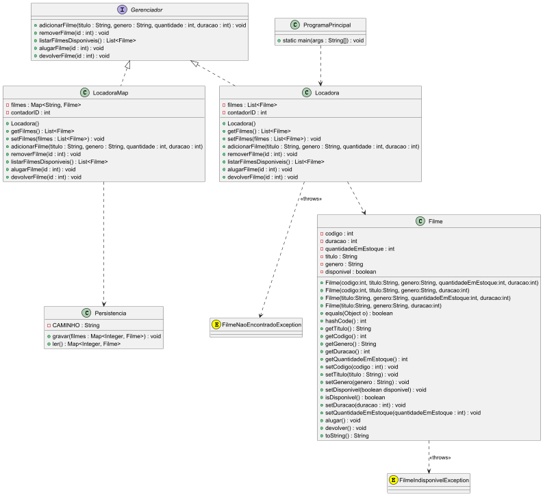

# Projeto de Poo por Emerson
## Locadora
Software que gerencia uma locadora de filmes, podendo adicionar,
remover, pesquisar, alugar e devolver filmes.

### Visão Geral
- Classe Filme é o modelador dos filmes
- Locadora e LocadoraMap, são as principais representações do nosso controle do sistema, sendo classes que implementam de uma interface Gerenciador
- O sistema armazena os dados por meio de serialização em um arquivo "locadora.txt"

### Tecnologias/Técnicas
- Classes do Java
- Classes para Test
- Interface
- Map e List
- Serializable

### Modelo Relacional do Sistema
